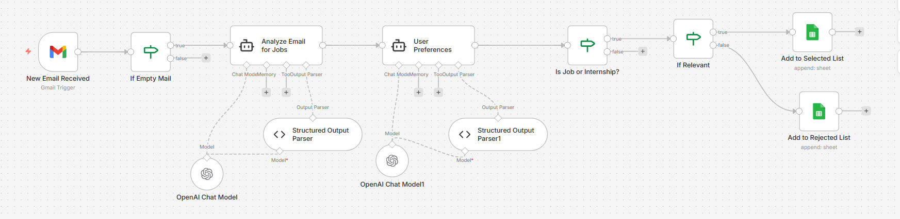
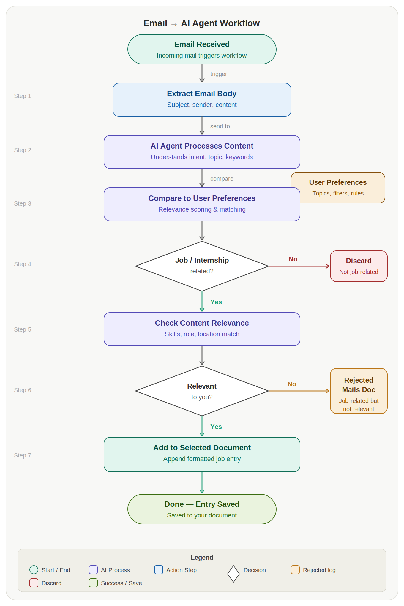
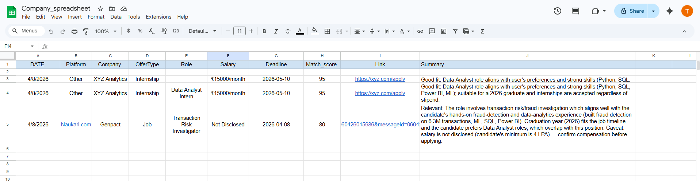
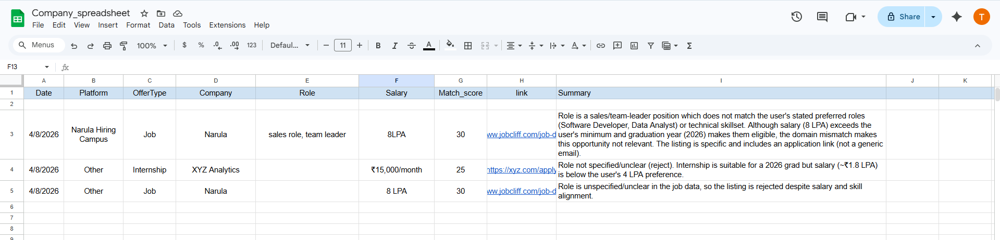
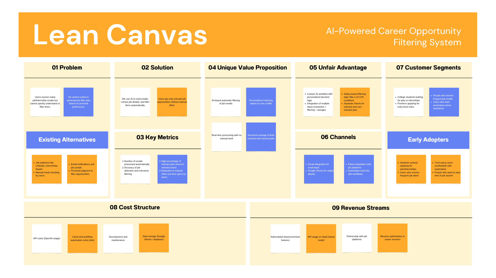

# 🚀 AI Career Opportunity Assistant  

An intelligent, workflow-driven system designed to automate the extraction, evaluation, and filtering of job and internship opportunities from email data using AI-based decision-making.

 

## 📌 Overview  

In the modern job ecosystem, students and fresh graduates are exposed to a large volume of opportunity-related emails from multiple platforms. These emails are often unstructured, repetitive, and misaligned with individual preferences, making manual filtering inefficient and error-prone.

This project addresses the problem by developing an **AI-powered automation pipeline** that transforms raw email content into structured, actionable insights. The system not only identifies valid opportunities but also evaluates their relevance based on a personalized user profile.

 

## 🎯 Objective  

- Automate the identification of job and internship opportunities from emails  
- Extract structured data from unstructured content  
- Evaluate opportunities based on user-specific criteria  
- Reduce manual effort and improve decision-making efficiency  

 

## ⚙️ System Architecture  

The system follows a multi-stage pipeline:

**Email Trigger → Validation → AI Agent 1 → Conditional Filtering → AI Agent 2 → Decision Engine → Google Sheets Storage**

Each stage is designed to progressively refine raw input into meaningful output.

 

## 🧠 Core System Logic  

### 🔹 Stage 1: Email Acquisition  
The workflow is triggered using a Gmail integration, which continuously monitors incoming emails and captures their content for processing.

 

### 🔹 Stage 2: Input Validation  
An initial validation layer ensures that empty or invalid emails are filtered out before entering the pipeline. This prevents unnecessary computation and API usage.

 

### 🔹 Stage 3: AI Agent 1 — Data Extraction  
The first AI agent is responsible for analyzing raw email content and extracting structured job-related information.

**Key Responsibilities:**
- Detect whether the email contains a real job/internship opportunity  
- Extract critical fields such as:
  - Company name  
  - Role/title  
  - Salary or stipend  
  - Application link  
  - Deadline  
  - Source platform  

**Important Behavior:**
- Ignores promotional, webinar, and non-relevant emails  
- Avoids guessing missing values (returns null instead)  
- Handles multiple opportunities by selecting the most relevant entries  

 

### 🔹 Stage 4: Conditional Filtering  
A logical condition evaluates whether the extracted content qualifies as a job or internship opportunity.

- If TRUE → proceeds to relevance evaluation  
- If FALSE → filtered out from further processing  

 

### 🔹 Stage 5: AI Agent 2 — Relevance Evaluation  
The second AI agent performs personalized evaluation using a predefined user profile.

**User Profile Includes:**
- Preferred roles (e.g., Software Developer, Data Analyst)  
- Minimum salary threshold (≥ 4 LPA for jobs)  
- Graduation year and eligibility  

**Evaluation Logic:**
- Rejects incomplete or unclear opportunities  
- Applies salary constraints for job roles  
- Accepts internships regardless of stipend (with role validation)  
- Calculates a **match score (0–100)** based on alignment  

 

### 🔹 Stage 6: Decision Engine  
Based on the evaluation output:

- Relevant opportunities → stored in **Selected dataset**  
- Non-relevant opportunities → stored in **Rejected dataset**  

 

### 🔹 Stage 7: Data Storage  
All processed data is stored in Google Sheets in a structured format, enabling easy tracking, filtering, and future analysis.

 

## 📸 System Implementation (Visual Evidence)  

### 🔹 Workflow Implementation (n8n)

This represents the actual automation pipeline built using n8n. It illustrates the integration of triggers, AI agents, conditional nodes, and storage mechanisms into a unified system.

 

### 🔹 Workflow Logic Flowchart

The flowchart provides a conceptual representation of the system logic, outlining how data moves through each stage of processing and decision-making.

 

### 🔹 Selected Opportunities Output

This dataset contains opportunities that meet the defined user criteria. Each entry includes structured attributes along with relevance indicators such as match score and decision status.

 

### 🔹 Rejected Opportunities Output

This dataset captures opportunities that were identified as job-related but did not satisfy the relevance conditions. Maintaining this dataset ensures transparency and traceability in decision-making.

 

### 🔹 Lean Canvas (Product Perspective)

The lean canvas outlines the problem space, solution approach, user segments, and value proposition, reflecting the product thinking behind the system design.

 

## 🧪 Edge Case Handling  

The system has been tested against multiple real-world scenarios to ensure robustness:

- Empty or missing email content  
- Non-job and promotional emails  
- Multiple opportunities within a single email  
- Missing salary or deadline fields  
- Low-salary job offers below threshold  
- Role mismatch with user preferences  

 

## 🛠️ Technology Stack  

- **n8n** — Workflow automation platform  
- **OpenAI API** — AI-based content analysis and decision-making  
- **Gmail Integration** — Input data source  
- **Google Sheets** — Structured data storage  

 

## 📊 Results & Impact  

- Successfully executed 100+ workflow runs for testing and validation  
- Reduced manual effort in job filtering significantly  
- Improved accuracy in identifying relevant opportunities  
- Established a scalable pipeline for automated decision-making  

 

## ⚠️ Limitations  

- Performance depends on API availability and response quality  
- Requires reasonably structured email content for optimal extraction  
- Currently limited to email-based input sources  

 

## 🔮 Future Scope  

- Integration with job platforms such as LinkedIn and Internshala  
- Resume-based dynamic personalization  
- Dashboard for analytics and tracking  
- Multi-user system with configurable preferences  

 

## 👤 Author  

**Tripti Kumari**  
B.Tech Computer Science Engineering  
Narula Institute of Technology  

- 📧 Email: vishwakarmap1305@gmail.com  
- 🔗 LinkedIn: https://www.linkedin.com/in/tripti-kumari-8b3abb253/  

 

## ⭐ Final Note  

This project demonstrates the practical application of AI and workflow automation in solving real-world problems. By combining structured data extraction with intelligent evaluation, the system transforms unorganized inputs into meaningful, decision-ready outputs.
